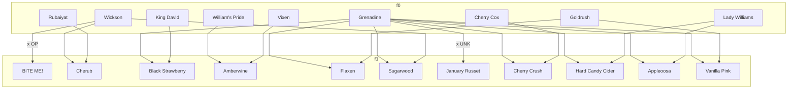

---
{"dg-publish":true,"permalink":"/000-intro-to-apple-breeding-project/","tags":"gardenEntry","dgShowLocalGraph":false}
---

# Summary/Intro

Project by Steven Edholm of [SkillCult](https://skillcult.com) to breed novel apples for homegrowers. This site was created and is maintained by Paul Younger, using Obsidian, published via digital-garden. Site source is located in [apple breeding github repo](https://github.com/trolltamer/AppleBreedingProject)

## Trait Groups/Lines
- [[100 Trait Groups (Lines)/Savory Apples\|Savory Apples]]
- [[100 Trait Groups (Lines)/Winter and Spring Hanging Apples\|Winter and Spring Hanging Apples]]
- [[100 Trait Groups (Lines)/Crab Apple Genetics\|Crab Apple Genetics]]
- [[100 Trait Groups (Lines)/Red Fleshed Apples\|Red Fleshed Apples]]
- [[100 Trait Groups (Lines)/Strongly and Uniquely Flavored Apples\|Strongly and Uniquely Flavored Apples]]
- [[100 Trait Groups (Lines)/Russet Apples\|Russet Apples]]

## Released Varieties

### Table of Released Varieties 

| File                                                            | Lines                                                                              | Generation (F#) | Parents                                           |
| --------------------------------------------------------------- | ---------------------------------------------------------------------------------- | --------------- | ------------------------------------------------- |
| [[200 Individual Apples/Appleoosa\|Appleoosa]]               | <ul><li>Red-Fleshed Apples</li></ul>                                               | 1               | <ul><li>Grenadine</li><li>Lady Williams</li></ul> |
| [[200 Individual Apples/BITE ME!\|BITE ME!]]                 | <ul><li>Strongly and Uniquely Flavored Apples</li></ul>                            | 1               | <ul><li>Wickson</li><li>OP</li></ul>              |
| [[200 Individual Apples/Black Strawberry\|Black Strawberry]] | <ul><li>Red-Fleshed Apples</li></ul>                                               | 1               | <ul><li>Grenadine</li><li>King David</li></ul>    |
| [[200 Individual Apples/Amberwine\|Amberwine]]               | <ul><li>Savory Apples</li></ul>                                                    | 1               | <ul><li>William's Pride</li><li>Vixen</li></ul>   |
| [[200 Individual Apples/Cherry Crush\|Cherry Crush]]         | <ul><li>Red-Fleshed Apples</li><li>Strongly and Uniquely Flavored Apples</li></ul> | 1               | <ul><li>Grenadine</li><li>Cherry Cox</li></ul>    |
| [[200 Individual Apples/Cherub\|Cherub]]                     | <ul><li>Crab Apples</li><li>Red-Fleshed Apples</li></ul>                           | 1               | <ul><li>Wickson</li><li>Rubaiyat</li></ul>        |
| [[200 Individual Apples/Flaxen\|Flaxen]]                     | <ul><li>Red-Fleshed Apples</li></ul>                                               | 1               | <ul><li>Grenadine</li><li>Goldrush</li></ul>      |
| [[200 Individual Apples/Hard Candy Cider\|Hard Candy Cider]] | <ul><li>Strongly and Uniquely Flavored Apples</li></ul>                            | 1               | <ul><li>Grenadine</li><li>Lady Williams</li></ul> |
| [[200 Individual Apples/January Russet\|January Russet]]     | <ul><li>Late Hanging Apples</li><li>Russet Apples</li></ul>                        | 1               | <ul><li>Grenadine</li><li>UNK</li></ul>           |
| [[200 Individual Apples/Vanilla Pink\|Vanilla Pink]]         | <ul><li>Red-Fleshed Apples</li><li>Strongly and Uniquely Flavored Apples</li></ul> | 1               | <ul><li>Grenadine</li><li>Goldrush</li></ul>      |
| [[200 Individual Apples/Sugarwood\|Sugarwood]]               | <ul><li>Crab Apples</li><li>Red-Fleshed Apples</li></ul>                           | 1               | <ul><li>Grenadine</li><li>Wickson</li></ul>       |

## Parent Apples

| File                                                                                          | Lines                                                                                             |
| --------------------------------------------------------------------------------------------- | ------------------------------------------------------------------------------------------------- |
| [[200 Individual Apples/William's Pride\|William's Pride]]                                 | <ul><li>Red-Fleshed Apples</li></ul>                                                              |
| [[200 Individual Apples/Rubinette\|Rubinette]]                                             | \-                                                                                                |
| [[200 Individual Apples/Sweet 16\|Sweet 16]]                                               | <ul><li>Strongly and Uniquely Flavored Apples</li></ul>                                           |
| [[200 Individual Apples/Wickson\|Wickson]]                                                 | <ul><li>Crab Apples</li><li>Strongly and Uniquely Flavored Apples</li><li>Savory Apples</li></ul> |
| [[200 Individual Apples/Vixen\|Vixen]]                                                     | <ul><li>Savory Apples</li></ul>                                                                   |
| [[200 Individual Apples/Newtown Pippin\|Newtown Pippin]]                                   | <ul><li>Late-Hanging Apples</li><li>Strongly and Uniquely Flavored Apples</li></ul>               |
| [[200 Individual Apples/Pink Parfait\|Pink Parfait]]                                       | <ul><li>Red-Fleshed Apples</li></ul>                                                              |
| [[200 Individual Apples/Rubaiyat\|Rubaiyat]]                                               | <ul><li>Red-Fleshed Apples</li></ul>                                                              |
| [[200 Individual Apples/Lady Williams\|Lady Williams]]                                     | <ul><li>Late Hanging Apples</li></ul>                                                             |
| [[200 Individual Apples/Maypole\|Maypole]]                                                 | <ul><li>Red-Fleshed Apples</li><li>Crab Apples</li></ul>                                          |
| [[200 Individual Apples/Grenadine\|Grenadine]]                                             | <ul><li>Red-Fleshed Apples</li></ul>                                                              |
| [[200 Individual Apples/Katherine (possibly mislabeled)\|Katherine (possibly mislabeled)]] | <ul><li>Late Hanging Apples</li></ul>                                                             |
| [[200 Individual Apples/King David\|King David]]                                           | <ul><li>Strongly and Uniquely Flavored Apples</li><li>Red Fleshed Apples</li></ul>                |
| [[200 Individual Apples/Goldrush\|Goldrush]]                                               | <ul><li>Strongly and Uniquely Flavored Apples</li></ul>                                           |
| [[200 Individual Apples/Chestnut Crab\|Chestnut Crab]]                                     | <ul><li>Crab Apples</li><li>Strongly and Uniquely Flavored Apples</li></ul>                       |
| [[200 Individual Apples/Golden Russet\|Golden Russet]]                                     | <ul><li>Russet Apples</li><li>Strongly and Uniquely Flavored Apples</li></ul>                     |
| [[200 Individual Apples/Cherry Cox\|Cherry Cox]]                                           | <ul><li>Strongly and Uniquely Flavored Apples</li></ul>                                           |

### Lineage Summary of the Program

### Lineage of Released Varieties

# Related Links

[SkillCult Apple Breeding Project Page](https://skillcult.com/applebreeding)
[SkillCult Apple Breeding Youtube Playlist](https://www.youtube.com/watch?v=SB5-4Nxej2I&list=PL60FnyEY-eJAMOPvU-yyF4JfuW5ocJvC4&index=1)
[SkillCult Blog Post Apple Breeding Project Part 1](https://skillcult.com/blog/2013/04/03/apple-breeding-part-1-everyone-knows-you-cant-do-it-right)
[SkillCult Blog Post Apple Breeding Project Part 2](https://skillcult.com/blog/2013/04/05/apple-breeding-part-2-doin-it-2)
[SkillCult Blog Post Apple Breeding Project Part 3](https://skillcult.com/blog/2013/04/11/apple-breeding-part-3-getting-from-seed-to-fruit)
[SkillCult Plant Breeding Video Category](https://skillcult.com/plant-breeding)
[[Sources and Documentation/YT Vid A Look at Some Parent Apples That I use\|Apple Parents Video]]