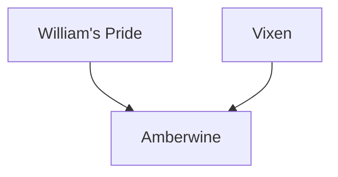

---
{"dg-publish":true,"permalink":"/200-individual-apples/amberwine/"}
---

# Summary

> [!quote] [Amberwine Variety Page on SkillCult](https://skillcult.com/amberwine)
> Amberwine is an early apple, but while William’s Pride ripens in August here, Amberwine ripens in September. When ripe, the background of the fruit turns a pretty amber color. The flesh also has some yellow coloring.

## Lineage

## Notes from SkillCult Homestead

> [!quote] [Amberwine Variety Page on SkillCult](https://skillcult.com/amberwine)
> The flavor is not complex, but very pleasant, with a significant amount of umami or savory flavor. [Read more about my savory apple breeding efforts at this link](https://skillcult.com/savory-apple-project). The savory component of Amberwine is what really makes it interesting. It gives it a depth uncommon in apples, becasue it builds on the palate the more you chew it. It also reminds me of wine, thus the name. Flavor wise, this is not a sensational apple. I like to say if it were be classified with other food, it would belong with the wine and cheese, not the candy. I have not had an opportunity to eat it with cheese, but I suspect they will make excellent companions
> The flesh is on the dense side, and the pulp is much finer textured than most apples. It doesn’t seem to have more pulp, and less than some, but the consistency is noticeably fine, like wood flour. The apple is not dry either. There is an adequate amount of juice and it leaves the pulp easily when chewed.

# Related Links
[[100 Trait Groups (Lines)/Savory Apples\|Savory Apples]]
[Amberwine Variety Page on SkillCult](https://skillcult.com/amberwine)
