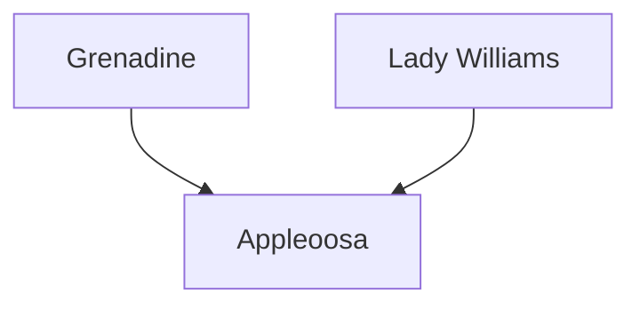

---
{"dg-publish":true,"permalink":"/200-individual-apples/appleoosa/"}
---

# Summary

> [!TODO]
> - [ ] trim down summary
> - [ ] move some of summary into Notes from SkillCult Homestead

>[!quote] Excerpt from [Appleoosa variety page on SkillCult](https://skillcult.com/appleoosa)
>Appleoosa is a cross between Grenadine and Lady Williams. I have not fruited this apple very much yet, due to a number of mishaps in which I nearly lost it altogether. I finally have a branch fruiting well, so I’ll find out more in the coming years and see if my suspicion that it will prove to be something like an improved grenadine is correct or not.
>
>Appleoosa has a very similar appearance to Grenadine, with dark pink to red skin, covered in large white speckles.n That is where the name came from, because it’s spotted like an appaloosa horse. I thought it was funny as a temporary name and then is stuck. I think that Appleoosa is probably going to prove to be a consistently better looking apple than grenadine, which will often fail to ripen well or develop full color. While Grenadine’s outside color seems to be mostly from the red flesh showing through the translucent skin, I think Appleoosa may actually have red skin to start with.
>
>Out of all the grenadine seedlings I’ve fruited, this one seems to be the most like grenadine in combining flesh color and complexity of flavor. It certainly can have a heaping helping of complex berry like flavor. It certainly can have some of the negative traits of Grenadine as well, like poor flesh texture when very ripe and fairly high skin tannins. One of my early goals was to just improve on grenadine while keeping the flesh color and flavor. I think this apple will likely prove over time to be that fruit. I don’t use grenadine in breeding any more. I now use Appleoosa and [[200 Individual Apples/Black Strawberry\|Black Strawberry]] instead, because I think both are at least a slight improvement and that is how this game works.
>
>Even though this fruit is largely untested, I put a few scions on auction in 2022, which sold for over 100.00 each in some cases! That’s how interested people are in this project and these red fleshed apples. Otherwise, just a few friends and patrons have ever received cuttings of this variety. My suspicion is that it will be much like an improved Grenadine, not the greatest for dessert, but useful in cider making and cooking. It’s highest value will likely be in breeding better red fleshed apples, with strong flesh color and delicious complex flavors.

## Lineage

## Notes from SkillCult Homestead

# Related Links
[Appleoosa variety page on SkillCult](https://skillcult.com/appleoosa)

