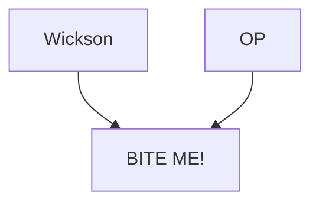

---
{"dg-publish":true,"permalink":"/200-individual-apples/bite-me/"}
---

# Summary

>[!quote] 
>BITE ME! is a small to medium sized apple.  The skin is red streaked over light yellowish when ripe and takes a very high polish with light rubbing.  Shape is oval and often smaller at the top than the bottom.  The flesh texture is good, sometimes leaning toward crisp and crunchy, but not ultra crisp.  The flavors are generally on the mild side, but this year it developed some of the unique flavor of it's parent Wickson.  The wickson flavor is hard to describe, but it's great and is really the reason I used Wickson seeds in the first place.  The sugar level is probably kind of average. I've seen quite a bit of scab on the apples, so that may prove to be an issue, but it's hard to say with only two year's observation.  I only have one branch, but it is very vigorous and tries to take over the whole tree, so I wouldn't be surprised if it makes a high vigor tree.

## Notes from SkillCult Homestead
### Notes from BITE ME! release video
Cleaving flesh, flavors of melon and sugarcane, some kind of fruit candy flavor and maybe some spice. Note super intensely flavored or dense, falls into a kind of "light eating" category. 

## Lineage

# Related Links
[BITE ME! cultivar page on SkillCult](https://skillcult.com/biteme)
[SkillCult Video on BITE ME!](https://youtu.be/OAFH-IafysQ)
[[100 Trait Groups (Lines)/Strongly and Uniquely Flavored Apples\|Strongly and Uniquely Flavored Apples]]

### Questions and Todos
- which other varieties have BITE ME! as their parent?
	- Add those to the Lineage diagram
