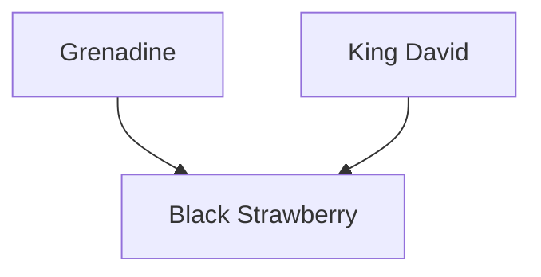

---
{"dg-publish":true,"permalink":"/200-individual-apples/black-strawberry/"}
---

# Summary

> [!TODO]
> - [ ] trim down summary
> - [ ] move some of summary into Notes from SkillCult Homestead

>[!quote] Excerpt from [Black Strawberry cultivate page on SkillCult](https://skillcult.com/black-strawberry)
>Black Strawberry is a Grenadine seedling. I’m fairly certain that it is a cross between King David and Grenadine. If I had to guess I’d say King David is the seed parent, but who knows. I go on the working assumption that those are the parents. 
>
Black Strawberry is what is sometimes called a black apple, meaning it is very dark red. Others include Black Oxford, Black Winesap and Arkansas Black. 
>
I have thought for a long time, that there might be a synergy between apples with very heavy red pigmentation in the skin, and red fleshed apples, that would encourage more red fleshed offspring. ..  in this case, we have both the dark red skin and red flesh. That red flesh also comes with some remarkable red flavor.
>
Like it’s parent Grenadine, Black Strawberry has a complex fruity flavor hinting of berries. But while Grenadine is kind of a mixed berries or fruit punch flavor, Black Strawberry leans heavily toward strawberry... The flavor of Black Strawberry is maybe a bit more reminicent of fake strawberry than real. It reminds me of strawberry flavored kids cereal, or strawberry flavored milk maybe. There are other flavors in there too, though I couldn’t name any. The flavor is this apple’s best trait, followed by the appearance, then things go downhill lol.
>
Like It’s parent Grenadine, Black Strawberry has some major issues. Both apples are quite tannic and puckery, especially the skin. That tannin could make this apple very useful for cider, but it can be a bit much for dessert use. They both tend to go meally as ripening proceeds, often suffering in texture a lot by the time the flavor is at it’s best. These are serious faults, and if it were not for the flesh color and flavor, neither of these apples would have much to offer.
>
What Black Strawberry did not seem to inheret is Grenadines tendency toward early drops. In some years, much of the Grenadine crop will develop waxy, greasy skin, ripen early and drop off the tree before there is any real development of flesh color and flavor.
>
Scab resistance and other disease traits are fairly unknown at this stage. I know it gets some scab, and both parents are quite susceptible, so that is not surprising.
>
Other traits, the bark of the shoots is noticeably dark red. The fruit is highly variable, in size, shape and quality. I have only one branch grafted onto an established tree to assess at this point, so I can’t say much about growth habits right now.
>
As I’ve said all along, I think of this more as a stepping stone fruit for breeding, than a legend in the making. I think it has high potential as a parent to use in pursuing the refinement of highly flavored red fleshed apples. It may have good promise as a cider apple as well. It is also worth putting up with it’s not so desirable characteristics for the remarkable flavor. I’m very curious to hear how it does elsewhere. I hope that somewhere it will be of much better eating quality, while retaining the great flavor.

## Lineage

## Notes from SkillCult Homestead

# Related Links
[Black Strawberry cultivate page on SkillCult](https://skillcult.com/black-strawberry)

