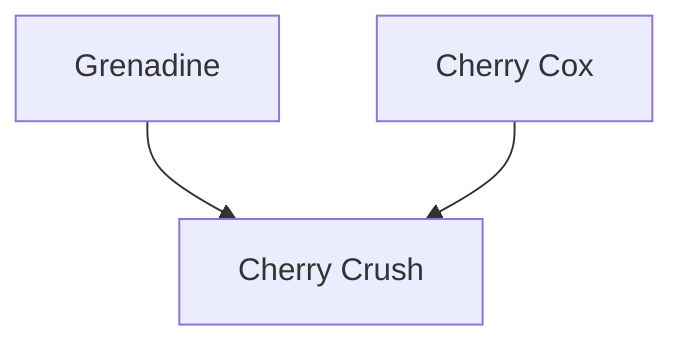

---
{"dg-publish":true,"permalink":"/200-individual-apples/cherry-crush/"}
---

# Summary
> [!TODO]
> - [ ] trim down summary
> - [ ] move some of summary into Notes from SkillCult Homestead

>[!quote] Excerpt from [Cherry Crush variety page on SkillCult](https://skillcult.com/cherry-crush)
>Cherry crush was first fruited in 2021. It is a cross between Grenadine and Cherry Cox. Grenadine being a very pink fleshed apple with incredible fruit punch flavor and Cherry Cox, a sport of Cox’s Orange Pippin, with a cherry flavor. This is an important apple to me in that it shows that the cherry flavor of Cherry Cox is transferable to offspring. This development is so encouraging, that I’m using Cherry Cox even more in breeding now.
>
Cherry crush is a tasty, pretty apple with nice flesh texture. It is all around pleasant eating. The flesh is a light pink in some cases and mottled in others. The flesh color is never dark and may not even develop in some climates, or in some years. While the apple is overall a nice desert apple, the distinguishing characteristic is definitely the subtle cherry flavor. It does not have an much cherry flavor as it’s parent Cherry Cox, nor is it as complexly flavored, but in other ways it is an improvement on that apple. Cherry Crush has better flesh texture and is larger. It has a very nice sugar to acid balance. It inhereted the some of Cox’s skin coloration, with wide paintbrush-like red treaks.
>
>I’m quite excited about this apple and have already sent out a couple hundred scions. The tree is growing on it’s own roots and seems pretty vigorous. I can’t say much about it’s growth habits, disease and so on at this time. I know I look forward to eating a lot of them this year and hopefully feeding them to a few other people. I have already started to use it in breeding. I crossed it back to cherry cox and crossed cherry cox onto it. I also crossed the pollen of Sweet 16, another cherry flavored apple, onto Cherry Crush and many others. I hope this apple does as well or better than it does here in other places. Great name, great sugar/acid balance, pretty, good sized, nice texture, intriguing unusual flavor, this one’s a winner and may have real staying power. We shall see.

## Lineage

## Notes from SkillCult Homestead

# Related Links
[Cherry Crush variety page on SkillCult](https://skillcult.com/cherry-crush)

