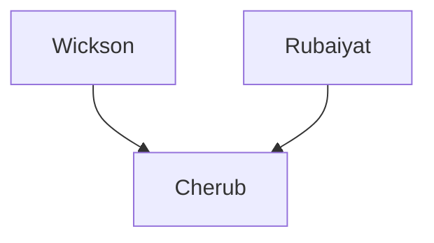

---
{"dg-publish":true,"permalink":"/200-individual-apples/cherub/"}
---

# Summary
>[!quote] [Excerpt from Cherub variety page on SkillCult](https://skillcult.com/cherub)
>Cherub is a cute little pink fleshed apple grown from seed that I pollinated in 2013. It is a cross between Wickson Crab and Rubaiyat. 
>...
>The skin can be quite red and pretty striking when well ripened in good light. Beneath the surface, the flesh varies from mottled pink to solid pink, depending on ripeness and probably other factors. Like it’s parent Rubaiyat, and many other red fleshed apples, it has some flavor reminiscent of berries. I have also tasted rose petal and burnt sugar or caramel. Besides those aromatic flavors, Cherub inhereted some of Wickson’s savory flavor, or Umame. Taken all together, this flavor combination is at times a little bit odd, but it is certainly not boring!
>...
>Cherub was the first apple to bear out of the 2013 seedlings at only five years old. That is the second fastest bearing seedling apple ever for me, so it appears to be precocious. It also has borne most years since. The fruit hangs on the tree well. As it hangs the flavor changes. The texture also changes. I’ve not seen it go meally at all, it actually becomes oddly watery and tender, almost like the flesh of a stone fruit. Those traits make for a long eating season.

## Lineage

## Notes from SkillCult Homestead
>[!quote] [Excerpt from Cherub variety page on SkillCult](https://skillcult.com/cherub)
>Cherub is a cute little pink fleshed apple grown from seed that I pollinated in 2013. It is a cross between Wickson Crab and Rubaiyat... 
>
This apple inherited traits of both of it’s parents. The skin can be quite red and pretty striking when well ripened in good light. Beneath the surface, the flesh varies from mottled pink to solid pink, depending on ripeness and probably other factors. Like it’s parent Rubaiyat, and many other red fleshed apples, it has some flavor reminiscent of berries. I have also tasted rose petal and burnt sugar or caramel. Besides those aromatic flavors, Cherub inhereted some of Wickson’s savory flavor, or Umame. Taken all together, this flavor combination is at times a little bit odd, but it is certainly not boring! I think some will find fault in in the flavor profile, while others will find intrigue. (I find both I guess lol.) That is to be expected. Apple tasting is subjective. I think if I could improve cherub, I would add a little more acid. Early in the season, it is balanced enough, but late in the season, it can become a little sugary and polite, which can have a cloying effect. The apple can be very sweet like it’s parent Wickson, my notes say 24%. Most others should not expect sugar levels this high, but it is on the high end in my dry California orchard.
>
Cherub was the first apple to bear out of the 2013 seedlings at only five years old. That is the second fastest bearing seedling apple ever for me, so it appears to be precocious. It also has borne most years since. The fruit hangs on the tree well. As it hangs the flavor changes. The texture also changes. I’ve not seen it go meally at all, it actually becomes oddly watery and tender, almost like the flesh of a stone fruit. Those traits make for a long eating season.

# Related Links
[[100 Trait Groups (Lines)/Crab Apple Genetics\|Crab Apple Genetics]]
[[100 Trait Groups (Lines)/Red Fleshed Apples\|Red Fleshed Apples]]
[Cherub variety page on SkillCult](https://skillcult.com/cherub)

