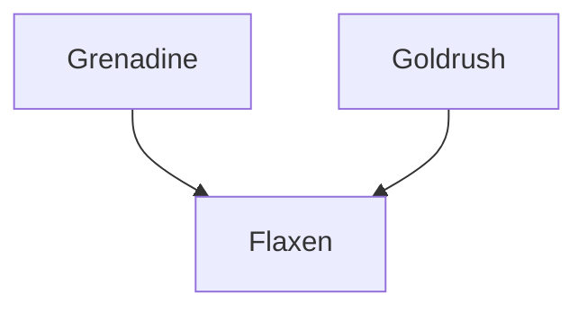

---
{"dg-publish":true,"permalink":"/200-individual-apples/flaxen/"}
---

# Summary

> [!quote] [Flaxen Variety page on SkillCult](https://skillcult.com/flaxen)
> Flaxen is a cross between Grenadine and Gold Rush. It is similar in appearance to gold rush and other apples related to Golden Delicious and Grime’s Golden. It tends to be blocky and uneven in shape. There is often, a star splash of russet coming out of the stemwell. It also has the familiar prominent speckling of russeted lenticils.

## Lineage

## Notes from SkillCult Homestead

>[!quote] [Flaxen Variety page on SkillCult](https://skillcult.com/flaxen)
>The flesh has a nice acid pop to it, but the apple is quite sweet. The flavor, while not particularly distinguished can be fairly rich. When it develops pink flesh, the flavor is maybe a little more complex and interesting. There can be a hint of citrus, probably lemon, though so far the citrus flavor has never been very more than a fleeting hint. One of the names I thought of for this apple was pink lemonade, because of the occasional pink flesh, lemon flavor and acidity. I’m still open to changing the name…
>Flaxen is a scab resistant apple so far. I’ve seen a few tiny specks, but nothing more than that. This trait would have been inherited from Gold Rush. If the scab resistance holds out, it makes this apple much more valuable. Flaxen is not a great apple by any stretch. But I like them and if it turns out to be very scab resistant, I think it will make a great apple to have around and probably a very good cooker as well. In my area, it is ripe around early October. Unlike it’s parent Gold Rush, it does not keep particularly well. I envision having one branch of it for munching with walnuts and for cooking in that season.

# Related Links
[Flaxen Variety page on SkillCult](https://skillcult.com/flaxen)
[SkillCult Video on Flaxen](https://youtu.be/9EKc2azN1vY)
