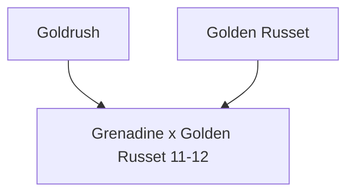

---
{"dg-publish":true,"permalink":"/200-individual-apples/grenadine-x-golden-russet-11-12/"}
---

# Summary
Label Tag: GN x GRT 11/12

## Lineage

## Notes from SkillCult Homestead
### Notes from [[Sources and Documentation/YT Vid Tasting Seedling Crosses\|YT Vid Tasting Seedling Crosses]]
**Visual Notes:**
Not an unattractive apple, smooth waxy, yellow, skin. Slightly angular (irregular) shape, with a more prominent "nose".
Extremely smooth skin, takes a high polish, waxy feel, lenticles are hard to see. Little bit of red blush on the sun side. 

**Tasting Notes:**
Quite sweet, not quite ripe, fairly high astringincy. Pretty good, crisp, some brownish spots that look like water core but are not water core, possibly due to nutrient deficiency in seedling rows. Lacks red pigment and the associated berry flavors. Quite good but not super compelling. 

# Related Links
[[[YT Vid Tasting Seedling Crosses\|[YT Vid Tasting Seedling Crosses]]

