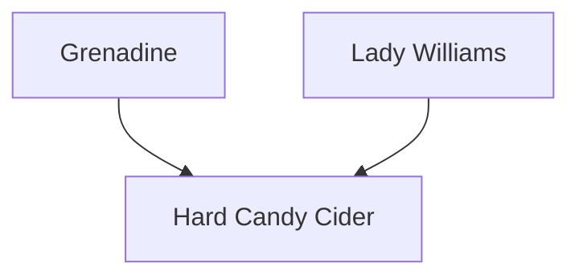

---
{"dg-publish":true,"permalink":"/200-individual-apples/hard-candy-cider/"}
---

# Summary

> [!TODO]
> - [ ] trim down summary
> - [ ] move some of summary into Notes from SkillCult Homestead

>[!quote] Excerpt from [Hard Candy Cider variety page on SkillCult](https://skillcult.com/hard-candy-cider)
>Hard Candy Cider is a cross between Grenadine and Lady Williams. The seed was pollinated in 2011. It is a fall ripening apple. This is a cider or processing apple, not a desert apple. It has a lot of tannin in the skin, and the texture is not great. It’s distinguishing characteristic if flavor. The flavor is like taking a bunch of diffrent fruit flavored hard candies and mixing them together. The flavors I have been able to pick out are watermelon and purple grape. The flavor can be very strong and is intriguing and delicious. My hope is that the flavor will survive, pressing, oxidation and fermentation to result in a highly flavored cider. We will find out someday. The sugar level is sort of medium, acidity, I can’t recall, but I think some.
>
>Out of all the apples I’ve fruited here that seem to have potential for cider, this might end up being the most legitimate for cider making. It took 10 years to fruit, now we wait another number of years for someone to grow enough fruit to make some cider with it. And of course, it’s easy to make bad cider, so someone has to actually make good cider with it, then we find out what’s really up with Hard Candy Cider.

## Lineage

## Notes from SkillCult Homestead

# Related Links
[Hard Candy Cider variety page on SkillCult](https://skillcult.com/hard-candy-cider)

