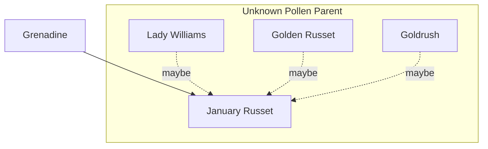

---
{"dg-publish":true,"permalink":"/200-individual-apples/january-russet/"}
---

# Summary

> [!TODO]
> - [ ] trim down summary
> - [ ] move some of summary into Notes from SkillCult Homestead

>[!quote] Excerpt from [January Russet variety page on SkillCult](https://skillcult.com/january-russet)
>January Russet is a Grenadine Seedling. If I had to guess, I’d say the other parent is Lady Williams, but my second guess would be Golden Russet and third, Gold Rush. This is not an apple for the milktoast crowd, who need the crust cut off their white bread and bologne sandwiches. January Russet is a rough and rustic apple. It is hard as a rock, astringent, sour and totally useless until it ripens in January. It is rough in appearance, rough in texture and not particularly polite in flavor. The skin is fairly tannic and puckery, even when ripe. Hey, it works for me :) It seems particularly sweet for a deep winter apple, possibly because the water content is low. The flavor is fairly complex and rich. Even when ripe, the flesh is still quite hard and requires some effort. My notes say it does not get apple scab very badly. If that is true, it might point toward Gold Rush as the second parent, as that apple is very scab resistant, while the other two possible parents are not.
>
There are two reasons that I released this apple into the public domain. One reason is that in season, I like eating it. It is a similar season to Lady Williams, Pomo Sanel and Pink Parfait. While Pink Parfait is another animal, I’d probably eat more of these than either Lady Williams or Pomo Sanel. That point alone is enoough for me to grow it and eat it. One of the criteria for a late hanging apple is that it maintains its integrity, not cracking or rotting. January Russet places medium in that trait. It is not the most durable, but not the least either. By the time it is ver ripe, the fruit will often crack.
>
The Second reason is that it is the closest thing I’ve seen to a bonified russet that hangs deep into the winter. I’m definitely interested in using it to breed toward high quality winter handing russets and have already made crosses with things like Sam Young, Allen’s Everlasting, Golden Russet and Ashmead’s Kernel.
>
This is probably an apple for the adventurous palette. It also will not perform in very cold regions. I wouold probably try it in areas that rarely go too much below 15 degrees f. I don’t know that it will not survive hanging in colder temps, but it seems like a good bet above 10 or 15 degrees. As far as picking it early and ripening off the tree, one could try, but I doubt that experiment will pay off. For those reasons, this is an apple that should be of limited interest to most. In my area of Northern California, north into parts of Oregona and Washington, south along the coast and east to parts of the southern states, it might be worth a try.

## Lineage

## Notes from SkillCult Homestead

# Related Links
[January Russet variety page on SkillCult](https://skillcult.com/january-russet)

