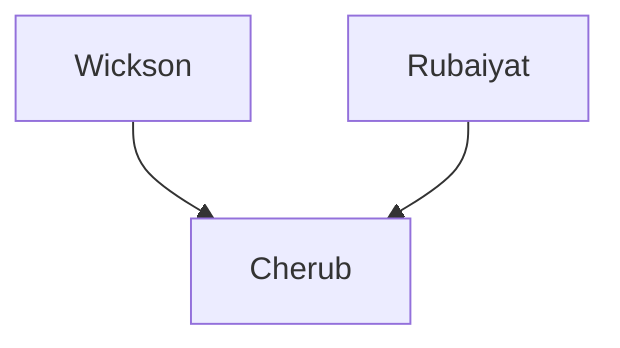

---
{"dg-publish":true,"permalink":"/200-individual-apples/rubaiyat/"}
---

# Summary

## Lineage

## Notes from SkillCult Homestead

### Summary from [[Sources and Documentation/YT Vid A Look at Some Parent Apples That I use\|Apple Parents Video]]

Deep red, velvety flesh

# Related Links
[SkillCult Parent Apples video section on Rubaiyat aka Etter 8/11](https://youtu.be/LIAM1_1z5IU?t=755)

