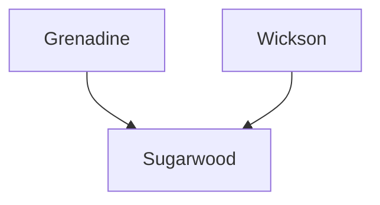

---
{"dg-publish":true,"permalink":"/200-individual-apples/sugarwood/"}
---

# Summary

> [!quote] Excerpt from [Sugarwood variety page on SkillCult](https://skillcult.com/sugarwood)
> Sugarwood is a cross between Grenadine and Wickson. It is a small sweet crab type apple that produces abundantly and hangs on the tree well. This is really a cider only variety. The flesh is quite hard and woody until it is super ripe, and then it’s still pretty solid. While the flesh is woody, it seems to release it’s juice easily and the juice flows out very clear. If I had to design a perfect pressing apple flesh, it would likely be close to this one.

Sugarwood also began displaying pink flesh once the tree matured beyond its first few years of bearing.

## Lineage

## Notes from SkillCult Homestead

> [!quote] Excerpt from [Sugarwood variety page on SkillCult](https://skillcult.com/sugarwood)
> The sugar levels are very high as the name suggests. I think it may be the sweetest apple I’ve measured here at 28%. Few can hope for the very high sugar levels I get here with little to no irrigation in the bright California sun and long cloudless summers, but it should still produce very high sugar levels elsewhere relative to most apples. I have a friend who makes wine and he prefers grapes much less sweet than this apple! Sugarwood has some tannin and acidity, but it is probably more of a blending apple for it’s sugar content than it is a single varietal cider apple. The juice could of course be used for drinking and processing as well. Flavor wise, it has more fruit flavor than Wickson and only a hint of that apples savory flavor. It hangs on the tree very well and seems to keep well off the tree as too. I think it will be possible to ripen this apple then put off harvesting until it’s convenient, or harvest and let it sit quite a while before pressing.
> One trait Sugarwood did not inheret from Wickson is the tendency to crack in the fall rains. Wickson is very prone to cracking and the whole crop can be lost most years if it’s not picked right before the first signficant rain. In 2021 we had what might be the worst drought year in living memory, in which I didn’t irrigate the trees. In the fall came extremely heavy early rains that saturated the ground. No cracking occured in Sugarwood, though many other varieties cracked.

>[!quote] Excerpt from [Tasting Apple Seedlings Thanksgiving 2022 YT Video](https://youtu.be/i2pVrNVNl3I?t=283)
>[Sugarwood] showing a considerable amount of pink flesh, I did not expect that from this apple when it first started fruiting
>

# Related Links
[Sugarwood variety page on SkillCult](https://skillcult.com/sugarwood)
[Tasting Apple Seedlings Thanksgiving 2022 YT Video](https://youtu.be/i2pVrNVNl3I?t=283)