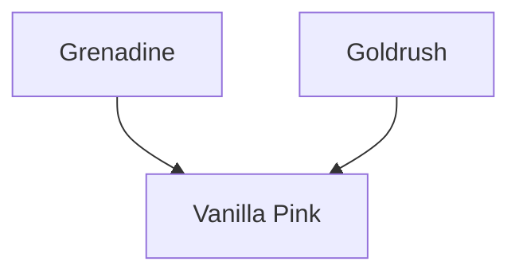

---
{"dg-publish":true,"permalink":"/200-individual-apples/vanilla-pink/"}
---

# Summary

> [!TODO]
> - [ ] trim down summary
> - [ ] move some of summary into Notes from SkillCult Homestead

>[!quote] Excerpt from [Vanilla Pink variety page on SkillCult](https://skillcult.com/new-page)
>Vanilla pink is a cross between Grenadine and Gold Rush. It has neon pink flesh and a unique candy like flavor.
> 
> This apple has fruited for a few years now and has long intrigued me. It has some negative traits that are frequently found in Grenadine offspring. The texture is not great, often grainy, running to meally as it ripens. It also has a fairly high tanin content in the skin. Despite these flaws, if I start eating one, I usually finish it.
> 
> Vanilla pink has some interesting fruit flavors going on, but the background flavor is something like vanilla, or a sweet candy. That flavor is it’s distinguishing characteristic and makes it intriguing to eat. This is no world conquering apple, but it’s a cool novelty and possibly useful in further breeding.
> 
> VIDEO SEGMENT SHOWING VANILLA PINK: https://youtu.be/k5b9GTL39tA?t=441

## Lineage

## Notes from SkillCult Homestead

# Related Links
[Vanilla Pink variety page on SkillCult](https://skillcult.com/new-page)

