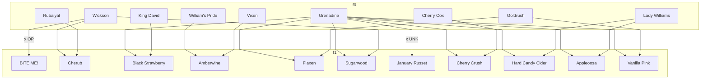

---
{"dg-publish":true,"permalink":"/released-varieties/"}
---

### Lineage of Released Varieties

## Table of Released Varieties

| File                                                            | Lines                                                                              | Generation (F#) | Parents                                           |
| --------------------------------------------------------------- | ---------------------------------------------------------------------------------- | --------------- | ------------------------------------------------- |
| [[200 Individual Apples/Appleoosa\|Appleoosa]]               | <ul><li>Red-Fleshed Apples</li></ul>                                               | 1               | <ul><li>Grenadine</li><li>Lady Williams</li></ul> |
| [[200 Individual Apples/BITE ME!\|BITE ME!]]                 | <ul><li>Strongly and Uniquely Flavored Apples</li></ul>                            | 1               | <ul><li>Wickson</li><li>OP</li></ul>              |
| [[200 Individual Apples/Black Strawberry\|Black Strawberry]] | <ul><li>Red-Fleshed Apples</li></ul>                                               | 1               | <ul><li>Grenadine</li><li>King David</li></ul>    |
| [[200 Individual Apples/Amberwine\|Amberwine]]               | <ul><li>Savory Apples</li></ul>                                                    | 1               | <ul><li>William's Pride</li><li>Vixen</li></ul>   |
| [[200 Individual Apples/Cherry Crush\|Cherry Crush]]         | <ul><li>Red-Fleshed Apples</li><li>Strongly and Uniquely Flavored Apples</li></ul> | 1               | <ul><li>Grenadine</li><li>Cherry Cox</li></ul>    |
| [[200 Individual Apples/Cherub\|Cherub]]                     | <ul><li>Crab Apples</li><li>Red-Fleshed Apples</li></ul>                           | 1               | <ul><li>Wickson</li><li>Rubaiyat</li></ul>        |
| [[200 Individual Apples/Flaxen\|Flaxen]]                     | <ul><li>Red-Fleshed Apples</li></ul>                                               | 1               | <ul><li>Grenadine</li><li>Goldrush</li></ul>      |
| [[200 Individual Apples/Hard Candy Cider\|Hard Candy Cider]] | <ul><li>Strongly and Uniquely Flavored Apples</li></ul>                            | 1               | <ul><li>Grenadine</li><li>Lady Williams</li></ul> |
| [[200 Individual Apples/January Russet\|January Russet]]     | <ul><li>Late Hanging Apples</li><li>Russet Apples</li></ul>                        | 1               | <ul><li>Grenadine</li><li>UNK</li></ul>           |
| [[200 Individual Apples/Vanilla Pink\|Vanilla Pink]]         | <ul><li>Red-Fleshed Apples</li><li>Strongly and Uniquely Flavored Apples</li></ul> | 1               | <ul><li>Grenadine</li><li>Goldrush</li></ul>      |
| [[200 Individual Apples/Sugarwood\|Sugarwood]]               | <ul><li>Crab Apples</li><li>Red-Fleshed Apples</li></ul>                           | 1               | <ul><li>Grenadine</li><li>Wickson</li></ul>       |
